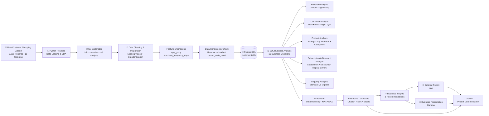

# 🛍️ Customer Shopping Behaviour Analysis

## 📌 Overview

This project is an **End-to-End Data and Business Analytics project** focused on understanding customer shopping behavior, purchasing patterns, product preferences, customer segments, revenue drivers, and subscription behavior. The project follows a complete analytics workflow from **data loading and cleaning in Python using Pandas**, to **SQL-based business analysis in PostgreSQL**, and finally **interactive visualization and dashboarding in Power BI**. The analysis is designed to transform raw transactional data into **actionable business insights and strategic recommendations**.

---
## 🎯 Business Objective

The primary objective of this project is to answer key business questions around:

* Customer purchasing behavior
* Revenue contribution across customer segments
* Product and category performance
* Subscription behavior
* Discount usage
* Customer loyalty and repeat purchases
* Shipping preferences
* Age-group purchasing patterns
* Product ratings and customer preferences

The findings are then translated into business recommendations that can support **customer retention, marketing, subscription growth, product positioning, and pricing/discount decisions**.

---
## Project Architecture




---

## 📊 Dataset

The dataset contains **3,900 customer purchase records** across **18 columns**.

### Key Features

* Customer demographics — Age, Gender, Location
* Subscription Status
* Product and Category
* Purchase Amount
* Season, Size, and Color
* Discount Applied
* Previous Purchases
* Purchase Frequency
* Review Rating
* Shipping Type

### Data Quality

The dataset initially contained **37 missing values in the Review Rating column**. These were handled during the Python data-cleaning stage.

---

## 🛠️ Tools & Technologies

| Tool           | Purpose                                           |
| -------------- | ------------------------------------------------- |
| 🐍 Python      | Data loading, cleaning, EDA & feature engineering |
| 🐼 Pandas      | Data manipulation and preprocessing               |
| 🗄️ PostgreSQL | Database storage and SQL analysis                 |
| SQL            | Business analysis and querying                    |
| 📊 Power BI    | Interactive dashboard & data visualization        |
| 🎨 Gamma       | Business insights presentation                    |
| 📝 GitHub      | Project documentation & portfolio                 |

---

## 🔄 Project Workflow

```text
Raw Dataset
     ↓
Python / Pandas
     ↓
Data Exploration & Cleaning
     ↓
Feature Engineering
     ↓
PostgreSQL Database
     ↓
SQL Business Analysis
     ↓
Power BI Dashboard
     ↓
Business Insights & Recommendations
     ↓
Report + Presentation
```

---

# 1️⃣ Data Loading & Exploratory Data Analysis

The dataset was initially loaded into Python using **Pandas**.

Initial exploration included:

* Dataset structure using `df.info()`
* Descriptive statistics using `df.describe()`
* Missing-value analysis
* Column inspection
* Data consistency checks

---

# 2️⃣ Data Cleaning & Preparation

Several preprocessing steps were performed to prepare the dataset for analysis.

### Missing Values

Missing values in `Review Rating` were handled using the **median review rating within each product category**.

### Column Standardization

Column names were converted to lowercase and standardized using underscores for improved readability and consistency.

### Feature Engineering

Two additional features were created:

* `age_group` — customers categorized into four age groups
* `purchase_frequency_days` — purchase frequency converted into numerical day intervals

### Data Consistency

The relationship between `discount_applied` and `promo_code_used` was checked for redundancy. Since the two fields contained equivalent information, `promo_code_used` was removed.

---

# 3️⃣ Database Integration

After cleaning and transformation, the processed Pandas DataFrame was connected to **PostgreSQL** using SQLAlchemy and Psycopg2.

The cleaned dataset was loaded into a PostgreSQL table named:

```text
customer
```

This allowed the cleaned data to be analyzed using SQL and structured business queries.

---

# 4️⃣ SQL Business Analysis

SQL was used to answer **10 business-focused questions**.

### Key Analyses

1. **Revenue by Gender**
   Compared total revenue generated by male and female customers.

2. **High-Spending Discount Users**
   Identified customers who used discounts while still spending above the average purchase amount.

3. **Top 5 Products by Rating**
   Identified products with the highest average review ratings.

4. **Shipping Type Comparison**
   Compared average purchase amounts between Standard and Express shipping.

5. **Subscribers vs. Non-Subscribers**
   Compared customer count, average spend, and total revenue based on subscription status.

6. **Discount-Dependent Products**
   Identified products with the highest percentage of discounted purchases.

7. **Customer Segmentation**
   Classified customers into:

   * New
   * Returning
   * Loyal

8. **Top Products by Category**
   Identified the top 3 most-purchased products within each category.

9. **Repeat Buyers & Subscriptions**
   Analyzed whether customers with more than 5 previous purchases were more likely to subscribe.

10. **Revenue by Age Group**
    Calculated the total revenue contribution of each customer age group.

---

# 5️⃣ Power BI Dashboard

The final analysis was transformed into an **interactive Power BI dashboard**


### Dashboard Features

* KPI cards for key business metrics
* DAX Analysis
* Revenue and sales analysis
* Customer segmentation
* Age-group analysis
* Category-level performance
* Subscription analysis
* Interactive filters and slicers
* Customer and purchasing behavior analysis

The dashboard provides a visual interface for exploring customer behavior and identifying important trends.

---

# 💡 Business Insights & Recommendations

The analysis produced several strategic recommendations:

### 📈 Boost Subscriptions

Promote exclusive benefits and incentives to increase customer subscription adoption.

### 🤝 Customer Loyalty Programs

Reward repeat customers and encourage movement toward the **Loyal** customer segment.

### 🏷️ Review Discount Strategy

Evaluate discount effectiveness while balancing sales growth with margin control.

### ⭐ Product Positioning

Highlight top-rated and best-selling products in marketing campaigns and promotional activities.

### 🎯 Targeted Marketing

Focus marketing efforts on high-revenue customer age groups and customers associated with higher-value purchasing behavior.

---

# 📁 Project Structure

```text
Customer-Shopping-Behavior-Analysis/
│
├── data/
│   └── customer_shopping_behavior.csv
│
├── python/
│   └── customer_shopping_behaviour_analysis_python_pandas.ipynb
│
├── sql/
│   └── Customer-Shopping-Behavior-Analysis_sql.sql
│
├── powerbi/
│   └── Customer_Shopping_Behavior_Dashboard.pbix
│
├── report/
│   └── Customer Shopping Behaviour Analysis_report.pdf
│
├── presentation/
│   └── Customer_Shopping_Behavior_Insights.pdf
│
├── screenshots/
│   └── dashboard.png
│
└── README.md
```

---

# ▶️ How to Run

## Step 1 — Clone the Repository

```bash
git clone https://github.com/yourusername/Customer-Shopping-Behavior-Analysis.git
cd Customer-Shopping-Behavior-Analysis
```

## Step 2 — Run the Python Analysis

Open the Jupyter Notebook:

```text
python/customer_shopping_behaviour_analysis_python_pandas.ipynb
```

Make sure the dataset is available in the appropriate directory before running the notebook.

The notebook performs:

* Data loading
* EDA
* Data cleaning
* Feature engineering
* PostgreSQL integration

## Step 3 — Set Up PostgreSQL

Create a PostgreSQL database and update the database connection details in the Python notebook.

The cleaned dataset will be loaded into the:

```text
customer
```

table.

## Step 4 — Run SQL Analysis

Open:

```text
sql/Customer-Shopping-Behavior-Analysis_sql.sql
```

Run the queries against the PostgreSQL `customer` table to reproduce the business analysis.

## Step 5 — Open the Power BI Dashboard

Open the `.pbix` file located in the `powerbi/` folder.

Update the data source connection if required.

---

# 📊 Project Deliverables

This repository contains the complete project workflow:

* 🐍 Python/Pandas analysis notebook
* 🗄️ SQL business analysis queries
* 📊 Power BI interactive dashboard
* 📄 Detailed project report
* 🎨 Business insights presentation created using Gamma
* 📝 Project documentation

---

## 🚀 Key Skills Demonstrated

**Data Analysis • Data Cleaning • Exploratory Data Analysis • Python • Pandas • SQL • PostgreSQL • Business Intelligence • Power BI • Data Visualization • Customer Segmentation • Business Insights • Data Storytelling**

---

## 👤 Author

**Pranav Sharma**

Data & Business Analyst | GenAI Enthusiast

---

⭐ If you found this project useful, feel free to explore the analysis, SQL queries, and Power BI dashboard.

